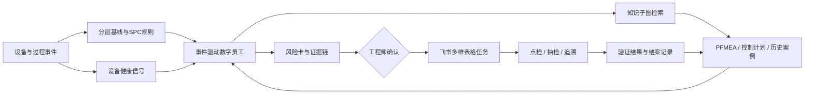

# 质控前哨

[](https://github.com/Gikemj/tightening-quality-guardian/actions/workflows/ci.yml)
[](https://gikemj.github.io/tightening-quality-guardian/)
[](LICENSE)

面向总装关键拧紧工位的设备质量风险主动管控原型。

> 本仓库是“2026 AI 先锋未来人才大赛”赛力斯集团命题的独立参赛原型。设备、工艺、质量和历史案例均为比赛合成数据，未使用赛力斯内部数据。

**报名项目：质控前哨｜队伍名称：智造哨兵**

**官方命题：如果你加入赛力斯超级工厂团队，你如何打造一名会主动管控设备质量风险的 AI数字员工？**


## 评委固定入口

- [统一在线演示](https://gikemj.github.io/tightening-quality-guardian/round2.html)：新版拧紧质量风险驾驶舱、实时合成回放、SPC 对照、证据链、任务门禁与独立评测集中在同一页。
- [演示视频（含中文字幕）](https://gikemj.github.io/tightening-quality-guardian/video/quality-guardian-v2.mp4)：按“工位窗口—多信号识别—证据核对—人工闭环”讲解新版项目，不展示第一轮原型入口。
- [第二轮参赛稿](docs/round2-submission.md)：与在线页面的工位、字段、关系链和安全边界保持同一口径。
- [数据边界说明](docs/data-boundary-round2.html)：说明公开案例、设备信号和企业数据之间的使用边界。
- [公开管理员工作台](https://gikemj.github.io/tightening-quality-guardian/admin.html)：评委无需安装或启动服务即可查看风险、证据、工作流、数据模拟器、接口契约与操作审计；所有按钮都在当前浏览器内产生可复现变化。

### 企业部署扩展

仓库保留可选的管理员服务端实现，用于企业授权环境接入受控文书模型与飞书。公开页面不加载密钥，也不依赖这一路径。若进入企业部署，将 `.env.example` 复制为 `.env`，填写服务端 `CODEKEY_API_KEY`（默认使用受控白名单中的 `CODEKEY_BASE_URL=https://hetune.top`、`CODEKEY_TERRA_MODEL=gpt-5.6-sol`），再运行：

```bash
PYTHONPATH=src python3 scripts/admin_server.py
```

该服务只用于受控部署验证。受控文书模型只接收最小化的脱敏风险卡摘要，用于整理复核说明和任务备注；输出必须通过结构校验，不能确认根因、停线、改 PLC 或替代工程师审批。密钥不会进入网页、日志、截图或提交记录。

## 四十强提交材料

- [完整参赛方案稿](docs/40-strong-submission.md)：按信息卡、场景痛点、创新、具体方案、业务价值、体验入口和自由展示组织，可复制到最终飞书文档。
- [业务价值与验收口径](docs/business-value.md)：严格区分合成原型结果、企业试点目标和待确认收益假设，附 Before/After 与收益公式。
- [企业试点与对照验证计划](docs/pilot-plan.md)：准备后先静默观察 2–4 周，再进行 4 周受控对照，包含安全门槛、归因与推广路线。

> 官方命题全称已按赛事页面核对。固定链接中的中文字幕 Demo 已完成；正式提交时只需按报名表补齐真实成员介绍与分工，并在具备授权的飞书测试租户中补留可核验的联调证据。仓库不虚构成员身份、租户权限或企业生产数据。

## 评委快速入口

- [打开在线演示](https://gikemj.github.io/tightening-quality-guardian/round2.html)，先看工位回放，再重放“规格内缓慢漂移”场景。
- [查看生成的风险卡](outputs/risk_card.json)，每条证据都带来源和定位字段。
- [查看离线验证结果](outputs/metrics.json)，数据、标签和计算脚本均可复现。
- [查看多场景独立合成评测](outputs/scenario_metrics.json)，包含 120 个案例、Wilson 区间和传统报警代理对照。
- [查看命题对齐表](docs/competition-alignment.md)，对应知识底座、Graph Retrieval、主动研判、证据链和飞书闭环。
- [查看安全与能力边界](docs/safety-boundaries.md)，区分当前原型、可选接入与尚待企业验证的能力。

## 与报名材料的口径

报名材料中的项目名称、试点工位和技术路线已在仓库中逐项对应。报名材料给出企业试点目标，仓库记录现阶段原型的离线结果。两类指标分别说明如下：

- 报名材料中的高风险召回率 ≥85%、误报率 ≤15%、平均提前 2 小时和定位时间缩短 30%，均为进入企业带教后的试点验收目标；
- 仓库中的召回率 94.4%、误报率 3.2%，只来自 P03 合成数据的 49 个滚动窗口，不能外推到真实工厂；
- 仓库另提供正常、规格内漂移、传感器零漂和重复报警各 30 个独立合成案例，用于验证场景分支和原因排序；其 100% 异常召回、0% 正常误报和 100% 预设原因 Top-1 命中不能外推到真实工厂；
- 多场景评测中的“传统报警”只是检查已有报警码或非 `OK` 结果的代理基线，不代表赛力斯现有系统。

| 能力 | 当前可核验状态 | 对外准确表述 |
|---|---|---|
| 异常检测 | 主演示滚动窗口 + 120 个多场景独立合成案例 | 已实现原型；生成器覆盖不代表工厂泛化，阈值需现场校准 |
| 知识检索 | 以异常对象为起点的有限关系子图检索 | 已实现 Graph Retrieval；不等同于完整 Graph RAG |
| Agent | [可审计工具编排](src/torque_guard/agent.py)、[证据约束](src/torque_guard/reasoning.py)与[受控状态流](src/torque_guard/workflow.py) | 默认确定性推理；有外部模型接口不等于已经调用模型 |
| 飞书协同 | 风险/任务字段、审批门禁及[真实/预览双模式客户端](src/torque_guard/integrations/feishu.py) | 代码具备经授权写入能力；实际企业租户联调证据仍需团队验证 |
| 业务收益 | 有 Before/After、试点和收益公式 | 尚无企业 ROI；只能报告试点目标和待确认测算变量 |

## 为什么从拧紧工位入手

选题初期考虑过设备故障预测，但单独判断设备是否失效，无法说明设备变化对整车质量的传导关系。结合智能车辆工程专业背景，原型将范围收敛到总装关键拧紧工位。该场景的数据链清楚：工具状态影响拧紧过程，过程波动对应紧固质量，处置结果回到设备点检和质量追溯记录。

原型只验证一个关键紧固点 P03。演示数据中，扭矩仍在 43–53 N·m 规格内，但最近 24 次同时出现以下变化：

- 扭矩均值较基线偏移 1.56σ；
- 拧紧角度离散度升至基线的 2.17 倍；
- 重试均值从 0.010 升至 0.250 次/循环；
- 工具距模拟标定到期 9 天；
- PFMEA 对应失效模式的严重度为 S=9。

系统先保存触发规则、数据窗口和文档来源，再按优先级列出套筒磨损、标定漂移等待验证原因。点检、抽检和批次追溯只生成任务草案，工程师确认后执行。

## 一次完整演示

| 环节 | 原型执行内容 | 可核验产物 |
|---|---|---|
| 感知 | 读取扭矩、角度、电流、节拍、重试、标定和生产上下文 | `data/tightening_events_demo.csv` |
| 检测 | 按紧固点分层计算基线、SPC 趋势和设备侧变化 | `src/torque_guard/spc.py` |
| 检索 | 从设备、工艺、失效模式、原因和动作关系中取回当前子图 | `knowledge/ontology.json` |
| 研判 | 合并直接数据、PFMEA、控制计划和相似案例，保留不确定性 | `outputs/risk_card.json` |
| 行动 | 生成责任角色、时限、验收依据和审批要求；通过门禁后才允许写任务 | `outputs/feishu_records_preview.json` |
| 流程门禁 | 本地状态机校验审批、建任务、验证、结案与重开；企业身份、持久化和案例回写尚待联调 | [飞书接入设计](docs/feishu-integration.md) |

在线演示默认显示已触发的风险窗口。点击“恢复基线窗口”可看到正常状态，再点击“重放风险识别”对比前后变化。公开环境没有企业凭证，任务操作保持预览/模拟；只有在授权环境配置应用与字段后，客户端才允许真实写入。

## 架构



Graph Retrieval 从异常对象 P03 和 TOOL-TG-07 开始，只取回当前失效链涉及的节点、关系和文档条目，再与时序信号一起写入风险卡。原型默认使用可复现的确定性推理器，并保存工具调用审计信息；企业试点可沿用证据结构接入 Graph RAG 与受控大模型，同时保留来源定位、Schema 校验、权限、失败回退和人工审批。除非审计轨迹明确记录一次外部调用成功，否则不得声称该次结果由大模型生成。


详细设计见 [架构说明](docs/architecture.md) 和 [研判方法](docs/method.md)。

## 离线验证结果

仓库有两套用途不同的验证。第一套是 P03 主演示序列的 49 个滚动窗口，用于验证“规格内漂移”的连续重放；相邻窗口共享大量记录，不能当成 49 个独立故障案例。

| 指标 | 当前结果 | 说明 |
|---|---:|---|
| 场景召回率 | 94.4% | 合成异常窗口中被识别为中/高风险的比例 |
| 精确率 | 94.4% | 被提示窗口中实际含合成异常的比例 |
| 误报率 | 3.2% | 正常窗口被提示的比例 |
| 证据可追溯率 | 100% | 风险证据同时具有来源和定位字段 |
| 任务字段完整率 | 100% | 任务包含责任角色、时限和验收依据 |

结果只能证明仓库内场景可复现，不能外推到真实工厂。真实部署需要按车型、程序号、紧固点和工具重新分层，并用企业数据校准阈值。计算方式和混淆矩阵见 [验证说明](docs/evaluation.md)。

第二套是 120 个独立合成案例，正常、规格内漂移、传感器零漂和重复报警各 30 个：

| 指标 | 当前结果 | 95% Wilson 区间 | 边界 |
|---|---:|---:|---|
| 三类异常召回率 | 100%（90/90） | 95.91%–100% | 只验证预设生成器覆盖的代码行为 |
| 正常场景误报率 | 0%（0/30） | 0%–11.35% | 样本有限，不能宣称真实误报率为 0 |
| 预设原因 Top-1 命中率 | 100%（90/90） | 未报告 | 预设标签不等于现场根因准确率 |
| 传统报警代理召回率 | 66.67%（60/90） | 未报告 | 代理只检查报警码/非 `OK`，不是企业系统实测值 |

原始结果见 [`outputs/scenario_metrics.json`](outputs/scenario_metrics.json)，评估脚本见 [`scripts/evaluate_scenarios.py`](scripts/evaluate_scenarios.py)。两套验证不能合并计算，也不能替代工程师盲标和企业对照试点。

## 本地复现

Python 运行部分只使用标准库；网页演示不依赖外部前端框架。

### Windows + Conda + VS Code

第一次使用或遇到解释器、终端、重建结果不同步的问题，可先看[本地部署与 VS Code 调试指南](docs/local-development.md)。

```powershell
conda activate huawei
python --version
python -m pip install -e .
python scripts/check_local_environment.py
python scripts/build_all.py
python -m unittest discover -s tests -v
node --test tests/web-engine.test.mjs
node --check docs/risk-engine.js
node --check docs/app.js
python scripts/audit_repository.py
python -m http.server 8000 --bind 127.0.0.1 --directory docs
```

浏览器打开 `http://localhost:8000`。`pip install -e .` 只需在新环境中执行一次，它把 `src/torque_guard` 以可编辑方式登记到当前 Python 环境；修改源码后不必重复安装。

VS Code 已提供调试与任务配置：

- 第一次打开项目时，先执行 `Tasks: Run Task` →“本地：检查 Python 与 Node 环境”，它只读取环境并明确显示 VS Code 实际使用的解释器；
- 按 `F5`，选择“质控前哨：调试风险分析”，即可用当前选中的 Python 解释器运行 CLI 并命中断点；
- 按 `Ctrl+Shift+P`，执行 `Tasks: Run Test Task`，默认“验证：全部提交门禁”会先重建确定性数据/产物，再依次运行 Python 测试、网页测试、脚本语法检查和仓库审计；
- 按 `F5`，选择“质控前哨：本地网页服务”，服务就绪后会自动打开浏览器；
- `.vscode/launch.json` 的 Python 调试配置会自动读取项目根目录 `.env`。普通 VS Code 终端直接执行 CLI 时不会自动读取 `.env`，必须先在当前终端设置所需环境变量；不要把真实密钥提交到仓库。

### Bash / Make

```bash
git clone https://github.com/Gikemj/tightening-quality-guardian.git
cd tightening-quality-guardian
make all
make serve
```

单独运行数字员工：

```bash
PYTHONPATH=src python3 -m torque_guard.cli \
  --input data/tightening_events_demo.csv \
  --knowledge knowledge \
  --point P03
```

测试覆盖 SPC 规则、多场景合成风险、知识子图、证据引用/拒答、真实调用边界审计、工作流非法越级、飞书预览/live 请求结构和浏览器权威数据消费。飞书 live 测试使用假传输，不访问企业租户。

## 仓库结构

```text
.
├── data/                  # 820 条确定性合成拧紧记录与清单
├── knowledge/             # 本体、PFMEA、控制计划、报警字典、历史案例
├── src/torque_guard/      # SPC、图检索、风险研判、Agent 与飞书适配器
├── scripts/               # 数据生成、演示资产构建、离线验证
├── tests/                 # Python 与浏览器侧测试
├── docs/                  # GitHub Pages 演示和技术文档
└── outputs/               # 风险卡、指标、飞书字段预览
```

## 安全边界

- 只读接入设备和质量数据；原型没有 PLC 写入能力。
- 停线、隔离批次、修改参数和确认根因均由授权工程师决定。
- 风险评分是运行期排序指数，不替代正式 PFMEA 的 S/O/D 或 RPN。
- 模型推断必须附候选原因、证据来源、置信度和验证方法。
- 数据缺失、车型切换、程序号变化和量具异常需要单独识别，不能混入同一基线。
- 外部接口默认关闭：飞书默认为本地预览；显式 live 模式只有在配置完整、工作流已记录具名批准事件且批准人/依据匹配时才会尝试写入风险表与任务表。仓库尚无授权租户或 Aily 联调证据。

完整说明见 [安全与权限边界](docs/safety-boundaries.md)。

## 官方资料

- [赛力斯集团命题详情页](https://activity.feishu.cn/future-talent?detail=sailisijituan)
- [赛力斯集团 2025 年半年度报告](https://cdn-web.seres.cn/uploads/20250902/16d86a4ef54310af944762148f4e9c3a.pdf)
- [赛力斯集团 2024 年年度报告](https://cdn-web.seres.cn/uploads/20250401/5cb4a1a9711d4df2daabb14d964625a0.pdf)

资料只用于理解企业数智质量方向。仓库中的设备名称、工位编号、参数窗口和效果指标均为独立构造的比赛演示内容。

## 项目状态

当前版本可以复现一个工位的主风险场景和三类异常的独立合成案例，包括数据读取、异常检测、知识检索、证据约束研判、真实调用审计、风险卡及本地工作流门禁。代码具备显式授权后的飞书多维表格 live 写入路径，但尚未发生真实 LLM、Aily 或授权企业租户调用，也没有真实工程师结案和企业收益。进入企业阶段首先应核对真实字段、分层基线、权限和验收口径，再按静默与对照计划验证；涂胶、焊接等工序须另行校准。
