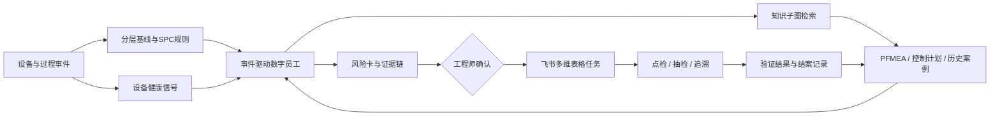

# 质控前哨

[](https://github.com/Gikemj/tightening-quality-guardian/actions/workflows/ci.yml)
[](https://gikemj.github.io/tightening-quality-guardian/)
[](LICENSE)

面向总装关键拧紧工位的设备质量风险主动管控原型。

> 本仓库是“2026 AI 先锋未来人才大赛”赛力斯集团命题的独立参赛原型。设备、工艺、质量和历史案例均为比赛合成数据，未使用赛力斯内部数据。

**报名项目：质控前哨｜队伍名称：智造哨兵**


## 评委快速入口

- [打开在线演示](https://gikemj.github.io/tightening-quality-guardian/)，重放“规格内缓慢漂移”场景。
- [查看生成的风险卡](outputs/risk_card.json)，每条证据都带来源和定位字段。
- [查看离线验证结果](outputs/metrics.json)，数据、标签和计算脚本均可复现。
- [查看命题对齐表](docs/competition-alignment.md)，对应知识底座、Graph Retrieval、主动研判、证据链和飞书闭环。

## 与报名材料的口径

报名材料中的项目名称、试点工位和技术路线已在仓库中逐项对应。报名材料给出企业试点目标，仓库记录现阶段原型的离线结果。两类指标分别说明如下：

- 报名材料中的高风险召回率 ≥85%、误报率 ≤15%、平均提前 2 小时和定位时间缩短 30%，均为进入企业带教后的试点验收目标；
- 仓库中的召回率 94.4%、误报率 3.2%，只来自 P03 合成数据的 49 个滚动窗口，不能外推到真实工厂；
- 材料提出曲线漂移、传感器失准和重复报警三类验证方向。当前仓库先把规格内漂移做成端到端主场景，标定漂移和历史重复问题已进入知识检索与验证任务，但未作为独立检测成绩报告。

## 为什么从拧紧工位入手

选题初期考虑过设备故障预测，但单独判断设备是否失效，无法说明设备变化对整车质量的传导关系。结合智能车辆工程专业背景，原型将范围收敛到总装关键拧紧工位。该场景的数据链清楚：工具状态影响拧紧过程，过程波动对应紧固质量，处置结果回到设备点检和质量追溯记录。

原型只验证一个关键紧固点 P03。演示数据中，扭矩仍在 43–53 N·m 规格内，但最近 24 次同时出现以下变化：

- 扭矩均值较基线偏移 1.56σ；
- 拧紧角度离散度升至基线的 2.17 倍；
- 重试均值从 0.010 升至 0.250 次/循环；
- 工具距模拟标定到期 9 天；
- PFMEA 对应失效模式的严重度为 S=9。

系统先保存触发规则、数据窗口和文档来源，再按优先级列出套筒磨损、标定漂移等待验证原因。点检、抽检和批次追溯只生成任务草案，工程师确认后执行。

## 一次完整演示

| 环节 | 原型执行内容 | 可核验产物 |
|---|---|---|
| 感知 | 读取扭矩、角度、电流、节拍、重试、标定和生产上下文 | `data/tightening_events_demo.csv` |
| 检测 | 按紧固点分层计算基线、SPC 趋势和设备侧变化 | `src/torque_guard/spc.py` |
| 检索 | 从设备、工艺、失效模式、原因和动作关系中取回当前子图 | `knowledge/ontology.json` |
| 研判 | 合并直接数据、PFMEA、控制计划和相似案例，保留不确定性 | `outputs/risk_card.json` |
| 行动 | 生成责任角色、时限、验收依据和审批要求 | `outputs/feishu_records_preview.json` |
| 闭环 | 工程师验证后回写结果，案例成为下一次检索的证据 | [飞书接入设计](docs/feishu-integration.md) |

在线演示默认显示已触发的风险窗口。点击“恢复基线窗口”可看到正常状态，再点击“重放风险识别”对比前后变化。任务按钮只生成预览，不会向外部系统发送数据。

## 架构



Graph Retrieval 从异常对象 P03 和 TOOL-TG-07 开始，只取回当前失效链涉及的节点、关系和文档条目，再与时序信号一起写入风险卡。原型使用可复现的确定性推理器。企业试点可沿用这套证据结构接入 Graph RAG 与受控大模型，同时保留来源定位、权限和人工审批。


详细设计见 [架构说明](docs/architecture.md) 和 [研判方法](docs/method.md)。

## 离线验证结果

验证对象是 P03 的 49 个滚动窗口。正样本为注入“规格内漂移”的窗口，负样本为正常窗口。

| 指标 | 当前结果 | 说明 |
|---|---:|---|
| 场景召回率 | 94.4% | 合成异常窗口中被识别为中/高风险的比例 |
| 精确率 | 94.4% | 被提示窗口中实际含合成异常的比例 |
| 误报率 | 3.2% | 正常窗口被提示的比例 |
| 证据可追溯率 | 100% | 风险证据同时具有来源和定位字段 |
| 任务字段完整率 | 100% | 任务包含责任角色、时限和验收依据 |

结果只能证明仓库内场景可复现，不能外推到真实工厂。真实部署需要按车型、程序号、紧固点和工具重新分层，并用企业数据校准阈值。计算方式和混淆矩阵见 [验证说明](docs/evaluation.md)。

## 本地复现

Python 运行部分只使用标准库；网页演示不依赖外部前端框架。

```bash
git clone https://github.com/Gikemj/tightening-quality-guardian.git
cd tightening-quality-guardian
make all
make serve
```

浏览器打开 `http://localhost:8000`。单独运行数字员工：

```bash
PYTHONPATH=src python3 -m torque_guard.cli \
  --input data/tightening_events_demo.csv \
  --knowledge knowledge \
  --point P03
```

测试覆盖 SPC 规则、规格内隐性风险、知识子图、人工审批约束、飞书字段预览和浏览器侧计算。

## 仓库结构

```text
.
├── data/                  # 820 条确定性合成拧紧记录与清单
├── knowledge/             # 本体、PFMEA、控制计划、报警字典、历史案例
├── src/torque_guard/      # SPC、图检索、风险研判、Agent 与飞书适配器
├── scripts/               # 数据生成、演示资产构建、离线验证
├── tests/                 # Python 与浏览器侧测试
├── docs/                  # GitHub Pages 演示和技术文档
└── outputs/               # 风险卡、指标、飞书字段预览
```

## 安全边界

- 只读接入设备和质量数据；原型没有 PLC 写入能力。
- 停线、隔离批次、修改参数和确认根因均由授权工程师决定。
- 风险评分是运行期排序指数，不替代正式 PFMEA 的 S/O/D 或 RPN。
- 模型推断必须附候选原因、证据来源、置信度和验证方法。
- 数据缺失、车型切换、程序号变化和量具异常需要单独识别，不能混入同一基线。
- 外部接口默认关闭；飞书部分只生成字段预览。

完整说明见 [安全与权限边界](docs/safety-boundaries.md)。

## 官方资料

- [赛力斯集团命题详情页](https://activity.feishu.cn/future-talent?detail=sailisijituan)
- [赛力斯集团 2025 年半年度报告](https://cdn-web.seres.cn/uploads/20250902/16d86a4ef54310af944762148f4e9c3a.pdf)
- [赛力斯集团 2024 年年度报告](https://cdn-web.seres.cn/uploads/20250401/5cb4a1a9711d4df2daabb14d964625a0.pdf)

资料只用于理解企业数智质量方向。仓库中的设备名称、工位编号、参数窗口和效果指标均为独立构造的比赛演示内容。

## 项目状态

当前版本可以复现一个工位的主风险场景，包括数据读取、异常检测、知识检索、风险卡和人工审批任务。若进入企业带教阶段，首要工作是核对真实字段、基线分层方式、权限模型和现场验收标准。涂胶、焊接等工序要在完成现场验证后再扩展。
