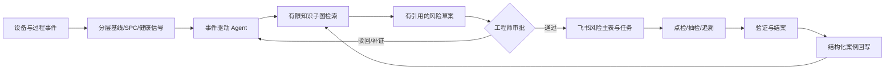
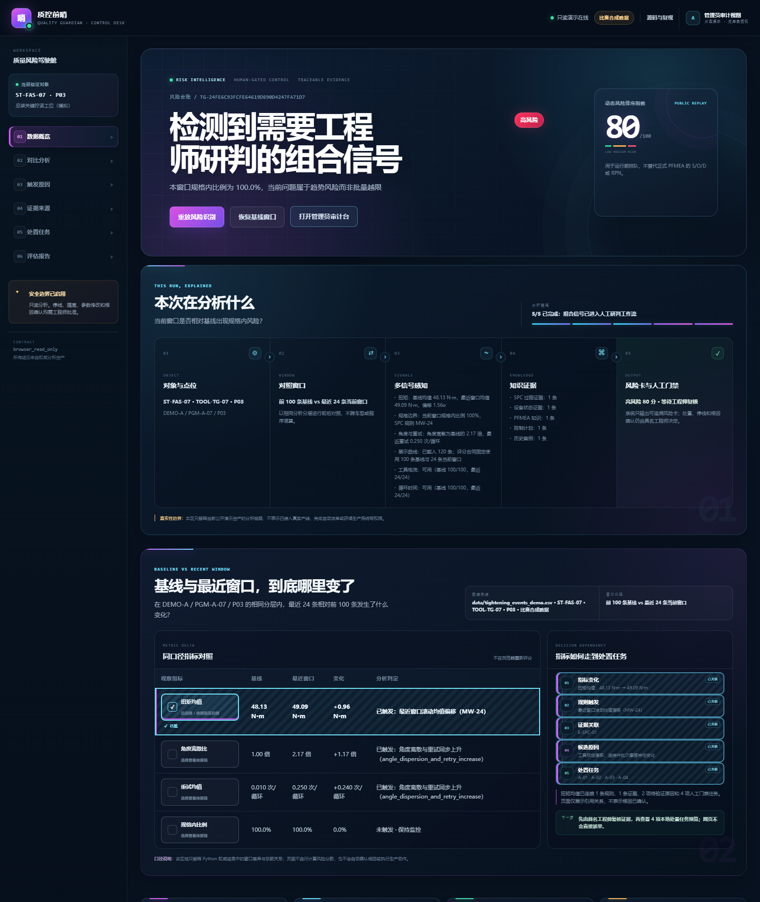
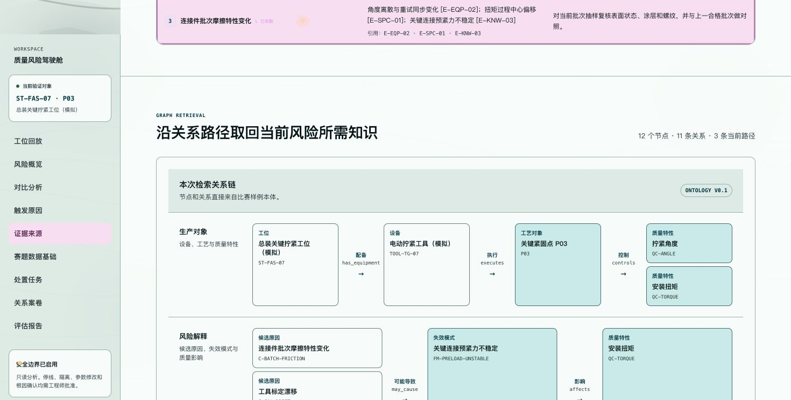

# 质控前哨｜四十强完整参赛方案

> 队伍：智造哨兵｜版本：仓库可核验稿｜更新日期：2026-08-06
> 本文可作为飞书完整方案的主体内容。赛事模板页当前提示在 8 月 16 日之前提交；正式提交前须完成下方“提交阻断项”，并将最终飞书文档开启“互联网获取链接可阅读权限”，再用无痕窗口验证。

## 提交阻断项

> **提交前需团队补充：每位真实成员的姓名、个人简介、联系方式（如模板要求）和对应交付物。** 仓库没有成员信息，本文不虚构姓名或人数。

> **提交前需团队完成：在授权测试租户中验证至少一项飞书 AI 能力并保留可核验截图或录屏。** 当前代码具备经授权写入飞书多维表格和接入外部模型的接口；公开环境默认使用本地预览与确定性推理，不能称为已完成真实 Aily、模型或企业租户调用。

> **提交前需团队补充：3–5 分钟 Demo 视频链接。** 建议按本文脚本录制，并确认无登录也能播放。

---

## 一、参赛方案信息卡（必须包含）

| 信息项 | 内容 |
|---|---|
| 队伍名称 | 智造哨兵 |
| 项目名称 | 质控前哨 |
| 所选企业 | 赛力斯集团 |
| 所选企业命题准确名称 | 如果你加入赛力斯超级工厂团队，你如何打造一名会主动管控设备质量风险的 AI数字员工？ |
| 一句话方案摘要 | 质控前哨面向总装关键拧紧工位，在产品尚未越出规格时联合识别过程与设备的缓慢变化，检索 PFMEA、控制计划和历史案例形成可追溯风险卡与任务字段预览，并保留经授权、可核验人工审批后的飞书受控写入接口。 |
| 当前原型范围 | 一个模拟工位、一个工具、五个紧固点；P03 为端到端主演示对象，另有三类异常的独立合成评测 |
| 当前数据范围 | 主演示为 820 条确定性合成记录；评测套件另生成 120 个独立合成案例；未使用赛力斯内部数据 |
| 飞书能力 | 目标采用 Aily/受控 Agent 与多维表格；代码具备授权写入接口，公开演示默认预览；真实租户联调证据需提交前补充 |
| 在线体验 | [GitHub Pages 在线演示](https://gikemj.github.io/tightening-quality-guardian/) |
| 开源证据 | [GitHub 仓库](https://github.com/Gikemj/tightening-quality-guardian/) |

### 成员介绍与分工

仓库无法证明成员身份，因此以下按工作包列出应披露的信息。正式提交时应按真实人数逐位写明“姓名—专业/经历—具体负责内容—可核验产物”，不能只写笼统的“共同完成”。

| 工作包 | 具体职责 | 可核验产物 | 负责人 |
|---|---|---|---|
| 项目与业务 | 痛点调研、场景收敛、指标定义、试点与答辩 | 本方案、业务价值模型、试点计划 | **提交前需团队补充真实姓名** |
| 数据与算法 | 合成数据、SPC、风险规则、离线评估 | `data/`、`src/torque_guard/spc.py`、`scripts/evaluate.py` | **提交前需团队补充真实姓名** |
| 知识与 Agent | 本体、关系检索、证据约束、工具编排和状态机 | `knowledge/`、Agent 审计轨迹、Prompt/Schema | **提交前需团队补充真实姓名** |
| 产品与协同 | 风险台账、交互、飞书字段与审批合同 | `docs/`、飞书适配器、演示视频 | **提交前需团队补充真实姓名** |
| 测试与交付 | 自动化测试、仓库审计、复现与提交权限检查 | `tests/`、CI、审计报告 | **提交前需团队补充真实姓名** |

同一成员可以承担多个工作包，但正式稿必须如实说明，不虚构团队规模。

---

## 二、真实业务场景与问题（必须包含）

### 2.1 为什么选择关键拧紧工位

关键连接的工具状态、拧紧过程和整车质量存在清晰传导链。常规产品规格回答“这一枪是否合格”，但过程稳定性还要回答“连续多枪是否正在偏离原来的健康状态”。一些早期风险可能在每次扭矩仍合格时，先表现为扭矩中心缓慢漂移、角度离散增大、重试增加或标定临近到期。若只等待越限、设备故障或后续抽检结果，工程师可能失去提前检查窗口。

本项目不把设备预测与质量判断割裂，而是围绕以下失效链组织证据：

```text
工具/套筒/标定变化
        ↓
扭矩、角度、重试等过程行为变化
        ↓
关键连接预紧力稳定性风险
        ↓
点检、抽检、批次追溯与工程师决定
```

### 2.2 现状痛点

1. **报警偏晚：**规格越限和设备故障适合确认已经发生的问题，不一定覆盖“规格内但持续失稳”的早期阶段。
2. **证据分散：**时序数据、标定/维修、PFMEA、控制计划和历史案例往往分布在不同系统或文档中。
3. **定位依赖经验：**工程师需要先判断看哪些曲线、查哪些文档、找谁核实，经验难以复制。
4. **告警不等于行动：**只给一个风险分数，仍缺责任人、时限、验证步骤、审批和验收依据。
5. **结案难沉淀：**现场最终原因和有效措施若没有结构化回写，下一次相似问题仍需从头排查。
6. **AI 可信边界模糊：**若生成式模型不带证据、权限和人工门禁，可能形成无法追溯或越权的建议。

### 2.3 Before：现状抽象流程


该流程是待企业访谈核对的业务假设，不代表赛力斯现状结论。试点第 0 阶段必须由企业确认真实流程、角色和系统。

### 2.4 原型主演示

演示使用比赛合成数据：P03 最近 24 次扭矩全部位于 43–53 N·m 规格内，但均值相对基线偏移 1.56σ、角度离散达到基线 2.17 倍、重试均值由 0.010 升至 0.250 次/循环。系统关联 PFMEA 严重度 S=9 的失效链，给出“套筒磨损、标定漂移、连接件批次摩擦变化”三个待验证原因，并生成点检、抽检和追溯任务草案。

这些数值可在 [`outputs/risk_card.json`](../outputs/risk_card.json) 核验，但只能证明仓库内场景，不代表真实产线表现。

除主演示外，仓库还对正常、规格内漂移、传感器零漂和重复报警各生成 30 个独立合成案例。三类异常共 90 例的召回率为 100%（95% Wilson 区间 95.91%–100%），30 个正常案例误报率为 0%（95% Wilson 区间 0%–11.35%），预设首要原因 Top-1 命中率为 100%。这些“过于整齐”的结果用于验证预设生成器与代码分支一致，不能表述为真实工厂准确率。对照中的传统报警代理只检查已有报警码或非 `OK` 结果，召回率 66.67%，并非赛力斯现有系统实测成绩。详见 [`outputs/scenario_metrics.json`](../outputs/scenario_metrics.json)。

---

## 三、方案优势与创新点（必须包含）

### 3.1 从“设备是否坏了”转向“设备变化如何传导到质量”

方案不是通用设备报警平台，而是围绕具体紧固点、程序、工具、失效模式和质量特性建立证据链。它优先发现尚未越限但正在累积的设备—过程—质量组合风险。

### 3.2 事实、推断和决定分层

- **事实：**原始量测、窗口、规则命中和文档条目；
- **推断：**带置信度和证据 ID 的候选原因；
- **决定：**由工程师审批的点检、抽检、追溯、隔离或结案。

这使 AI 输出可以被反驳和验证。历史案例只能提高候选原因优先级，不能单独确认根因。

### 3.3 有限子图检索，而不是把整库塞给模型

原型从异常对象 P03、工具 `TOOL-TG-07` 出发，沿“工位—设备—程序—紧固点—质量特性—失效模式—原因—验证动作”关系取回有限子图，再联合 PFMEA、控制计划和历史案例。当前实现是确定性的 Graph Retrieval，不伪称已经完成向量召回、重排和生成模型闭环的 Graph RAG。

### 3.4 可审计 Agent，而不是一段固定宣传文字

Agent 以“感知—检测—检索—研判—行动”推进，工具调用记录输入/输出摘要、耗时、成功/失败和推理器类型。默认确定性推理器要求结论引用证据 ID；证据不足时应拒绝给出确定结论。受控 Prompt 和 JSON Schema 为后续接入外部模型提供同一输出契约。实现见 [`src/torque_guard/agent.py`](../src/torque_guard/agent.py)、[`src/torque_guard/reasoning.py`](../src/torque_guard/reasoning.py) 和 [`src/torque_guard/prompts/`](../src/torque_guard/prompts)。

每张风险卡带有 `schema_version=1.0`，并保存人工维护的风险策略版本、规范化知识语义 SHA-256、规范化实际分析窗口 SHA-256 和卡片身份 SHA-256。策略规则变更必须同步递增版本，知识或输入语义变化则由各自 SHA-256 反映；这些信息支持公开资产复现。当前没有企业密钥签名，不能把版本号或普通 JSON 指纹描述成防篡改审计。

### 3.5 从风险卡到责任闭环

风险卡不仅列风险分数，还包含对象、影响窗口、证据、候选原因、验证方法、责任角色、时限、审批要求和验收依据。工作流限制非法状态跳转：任务只有在审批后才可创建，结案必须有验证结果。状态与门禁实现见 [`src/torque_guard/workflow.py`](../src/torque_guard/workflow.py)。

### 3.6 安全优先的可落地路径

系统只读生产数据，不写 PLC；停线、参数修改、批次隔离和根因确认始终由授权工程师决定。无凭证时飞书适配器只生成预览，不把“按钮反馈”冒充真实任务创建。

---

## 四、具体方案说明（必须包含，重点突出 AI）

### 4.1 After：目标工作流



### 4.2 六层架构

| 层 | 输入与处理 | 输出 | 当前状态 |
|---|---|---|---|
| 数据层 | 扭矩、角度、电流、节拍、重试、标定、车型、程序、批次 | 可追溯事件窗口 | 合成数据已实现；真实字段待核对 |
| 检测层 | 分层基线、SPC 规则、设备侧变化 | 规则命中与计算明细 | 主场景及三类独立合成异常已实现；真实阈值待校准 |
| 知识层 | 本体、PFMEA、控制计划、报警字典、历史案例 | 有来源的有限子图 | 已实现关系检索；非完整 Graph RAG |
| Agent 层 | 受控工具、证据约束、状态机、Prompt/Schema | 风险卡、审计轨迹、拒答或任务草案 | 可审计底座已实现；默认确定性推理，外部模型为可选接口 |
| 协同层 | 审批、字段映射和权限 | 风险主记录、任务、验证与结案 | 具备真实/预览双模式代码；租户联调待验证 |
| 展示与审计 | 风险台账、证据链、工具轨迹、指标口径 | 面向工程师和评委的可核验页面 | 已实现公开演示 |

### 4.3 AI 的角色与边界

本方案把 AI 用于“证据范围内的组织、关联、排序和协同”，不允许其替代产品放行或设备控制：

1. 主动读取最新事件并调用检测工具，而不是等待用户提问；
2. 根据异常对象选择受控知识检索范围；
3. 把直接数据、规则、文档和历史类比组织为结构化风险草案；
4. 每个候选原因必须引用证据 ID，并附现场验证方法；
5. 证据不足、工具失败或 Schema 不合格时拒答或降级；
6. 工程师审批后才创建协同任务；
7. 结案事实回写知识案例，供下一次检索使用。

当前公开运行不调用外部大模型，所以“可选外部模型接口”不能写成“已使用大模型取得效果”。真实接入时，必须记录模型、Prompt 版本、输入证据 ID、结构化输出、耗时和失败回退。

### 4.4 飞书 AI 与协同设计

计划在授权租户中使用：

- **Aily / 受控 Agent：**配置只读数据工具、SPC 工具、知识检索工具、风险草案工具和审批后建任务工具；
- **多维表格：**风险主表、任务子表、知识案例表；
- **审批与消息：**审批通过后创建任务，超时或失败进入可审计状态，不自动执行生产控制。

当前仓库已能构造与发送所需字段，且无凭证默认预览。真实租户的应用权限、表格 ID、人员目录、审批规则、幂等重试和截图/录屏仍需提交前或企业试点中验证。详细字段见 [`docs/feishu-integration.md`](feishu-integration.md)。

### 4.5 数据与知识资产

- 数据卡：[`docs/data-card.md`](data-card.md)
- 合成数据：[`data/tightening_events_demo.csv`](../data/tightening_events_demo.csv)
- 多场景独立合成指标：[`outputs/scenario_metrics.json`](../outputs/scenario_metrics.json)
- 知识本体：[`knowledge/ontology.json`](../knowledge/ontology.json)
- PFMEA：[`knowledge/pfmea_demo.csv`](../knowledge/pfmea_demo.csv)
- 控制计划：[`knowledge/control_plan_demo.csv`](../knowledge/control_plan_demo.csv)
- 历史案例：[`knowledge/historical_cases.json`](../knowledge/historical_cases.json)
- 风险卡：[`outputs/risk_card.json`](../outputs/risk_card.json)
- 飞书字段结果：[`outputs/feishu_records_preview.json`](../outputs/feishu_records_preview.json)

### 4.6 为什么不是“只做一个聊天机器人”

现场需要持续检测、结构化证据、明确责任和审批，而不是依赖人员每次重新描述问题。聊天可以作为查询入口，但核心链路由事件、工具、数据契约和状态机驱动；结果能复现、能追责、能拒答，也能在接口失败时降级。

---

## 五、方案价值（必须包含）

### 5.1 已验证、目标与收益假设

| 层级 | 指标 | 结论 |
|---|---|---|
| 已验证·合成原型 | 召回率 94.4%、精确率 94.4%、误报率 3.2% | 来自 P03 的 49 个高度重叠滚动窗口；只能证明场景可复现 |
| 已验证·独立合成套件 | 异常召回率 100%、正常误报率 0%、预设原因 Top-1 100% | 120 个预设案例；召回 95% Wilson 区间 95.91%–100%，误报率区间 0%–11.35%；只验证代码行为 |
| 已验证·代理对照 | 传统报警代理召回率 66.67% | 代理仅检查报警码/非 `OK`，不是企业现有系统实测基线 |
| 已验证·合成原型 | 证据可追溯率 100%、任务字段完整率 100% | 证明数据结构完整，不代表现场结论或真实任务已完成 |
| 试点目标·待现场验证 | 高风险召回率 ≥85%、误报率 ≤15% | 以去重的独立风险事件和工程师真值为单位 |
| 试点目标·待现场验证 | 平均提前介入 ≥2 小时 | 相对企业现有流程，按同类失效模式比较 |
| 试点目标·待现场验证 | 定位时间中位数缩短 ≥30% | 用同一定义采集 Before/After 工单时间戳 |
| 测算假设·待企业确认 | 返工、报废、停机、逃逸与工时收益 | 企业提供真实事件量和成本后才计算，不预写金额 |

### 5.2 业务价值路径

- **时间：**从等越限或后验质量结果，前移到组合信号出现后介入；
- **效率：**把查曲线、PFMEA、控制计划和案例的准备工作收敛为带定位的风险卡；
- **质量：**通过更早验证减少风险扩大，但必须由对照试点证明；
- **协同：**风险、审批、责任、时限、附件、验收和结案放在同一关联记录中；
- **知识：**最终原因与有效措施成为有版本、有批准人的新案例；
- **治理：**事实、推断、权限和人工决定分离，降低黑箱自动化风险。

年度收益统一按以下公式核算：

```text
年度净收益
= 避免的质量逃逸损失
+ 减少的返工与报废成本
+ 减少的非计划停机成本
+ 节省的工程分析工时价值
- 系统建设与年度运行成本
```

完整 Before/After 表、变量定义、归因规则与回收期公式见 [`docs/business-value.md`](business-value.md)。

### 5.3 试点验证

建议执行“准备与口径冻结 3–5 个工作日 + 静默观察 2–4 周 + 受控对照 4 周”。静默期不主动派单；受控期不移除现有质量保障，只比较增加风险卡后是否带来增量价值。完整计划、停止条件和推广门槛见 [`docs/pilot-plan.md`](pilot-plan.md)。

---

## 六、成果展示与体验入口（强烈建议）

### 6.1 在线体验

[打开质控前哨在线演示](https://gikemj.github.io/tightening-quality-guardian/)

建议按以下顺序体验：

1. 先看默认 P03 风险窗口：扭矩仍在规格内，但风险等级已升高；
2. 展开证据链，核对数据、规则、PFMEA、控制计划和历史案例的来源与定位；
3. 查看候选原因，区分已观测事实与待验证推断；
4. 查看 Agent 工具轨迹和任务状态；
5. 点击“恢复基线窗口”，对比正常状态；
6. 再次重放风险识别，观察统一口径生成的风险卡；
7. 任务操作在公开环境只展示预览或模拟状态，不代表已写入企业租户。





### 6.2 3–5 分钟 Demo 视频脚本

| 时间 | 画面 | 讲解重点 |
|---:|---|---|
| 0:00–0:30 | 项目名、信息卡、业务失效链 | 为什么“合格”不等于“过程稳定” |
| 0:30–1:15 | 基线窗口切换到风险窗口 | 规格内 1.56σ 漂移、角度离散和重试同步变化 |
| 1:15–2:05 | 展开证据链与知识关系 | 每条结论可回到数据、规则或文档定位 |
| 2:05–2:45 | 候选原因、拒绝越权与 Agent 轨迹 | 原因是待验证假设；AI 不自动停线或确认根因 |
| 2:45–3:30 | 审批、飞书风险/任务与异常路径 | 审批后才写任务；展示真实租户证据或明确是预览 |
| 3:30–4:10 | Before/After、试点和推广 | 三类指标分层，展示 2–4 周静默 + 4 周对照 |
| 4:10–4:30 | 复现入口与安全声明 | 合成数据、开源代码、真实价值待现场验证 |

**视频链接：提交前需团队补充，并用无痕窗口和手机网络验证可播放。**

---

## 七、自由展示：可信、可复现、可推广

### 7.1 原型证据清单

| 评委可能追问 | 可核验证据 |
|---|---|
| 数据从哪里来？ | [`data/manifest.json`](../data/manifest.json)、[`scripts/generate_demo_data.py`](../scripts/generate_demo_data.py)、[`docs/data-card.md`](data-card.md) |
| 规则如何计算？ | [`src/torque_guard/spc.py`](../src/torque_guard/spc.py)、[`docs/method.md`](method.md) |
| 风险为什么得到当前分数？ | [`src/torque_guard/risk.py`](../src/torque_guard/risk.py)、[`outputs/risk_card.json`](../outputs/risk_card.json) |
| 知识如何关联？ | [`src/torque_guard/knowledge.py`](../src/torque_guard/knowledge.py)、[`knowledge/ontology.json`](../knowledge/ontology.json) |
| 指标能否重现？ | [`scripts/evaluate.py`](../scripts/evaluate.py)、[`outputs/metrics.json`](../outputs/metrics.json)、[`docs/evaluation.md`](evaluation.md) |
| 多场景结果如何产生？ | [`scripts/evaluate_scenarios.py`](../scripts/evaluate_scenarios.py)、[`outputs/scenario_metrics.json`](../outputs/scenario_metrics.json)；结果只验证合成代码行为 |
| 飞书是否真的写入？ | 公开环境默认预览；真实调用必须以授权租户日志/截图为准，不能用本地 JSON 冒充 |
| Agent 是否真的执行工具？ | [`src/torque_guard/agent.py`](../src/torque_guard/agent.py) 与 [`src/torque_guard/workflow.py`](../src/torque_guard/workflow.py)；轨迹来自真实调用边界，并记录失败，不是固定展示文字 |
| AI 是否真的调用大模型？ | [`src/torque_guard/reasoning.py`](../src/torque_guard/reasoning.py)；默认确定性推理，只有审计轨迹明确记录外部模型成功调用时，才可声称该次使用 |
| Prompt 和输出约束在哪里？ | [`system_prompt.txt`](../src/torque_guard/prompts/system_prompt.txt) 与 [`reasoning_output.schema.json`](../src/torque_guard/prompts/reasoning_output.schema.json) |
| 系统会不会自动停线？ | 不会；见 [`docs/safety-boundaries.md`](safety-boundaries.md) |

### 7.2 局限性

- 单一主演示工位、工具和车型/程序；虽增加三类异常的独立合成评测，仍未覆盖真实现场分布；
- 合成标签难度低于真实工厂，且 49 个滚动窗口高度重叠；
- 独立合成套件由预设生成器产生，100% 召回和原因命中不能外推；传统报警代理也不代表企业现有系统；
- 未覆盖维修后基线重建、传感器故障、长期季节性变化和概念漂移；
- 当前阈值未按真实误报成本校准；
- 尚无人工工程师盲测、真实租户调用证据和企业 ROI；
- 当前是关系检索与确定性证据推理底座，不把它包装成已经完成的全量 Graph RAG 或无人监督自主系统。

主动写清限制并不是削弱方案，而是给出一条可被企业验收的落地路径。

### 7.3 推广路径

先在同工具/同程序增加紧固点，再扩展到同工艺的不同工具和车型，完成跨工厂数据与权限隔离后，最后才复用工作流骨架到涂胶、焊接等工序。每一级重新经过数据核对、静默观察、安全门槛和对照验证，不直接复制拧紧阈值。

---

## 八、正式提交前核验清单

### 内容完整性

- [x] 官方企业命题准确全称已按官方命题页逐字填写；
- [ ] 每位真实成员的介绍、分工和可核验产物已填写；
- [ ] 至少一项真实使用的飞书 AI 能力有授权租户截图、录屏或日志证据；
- [ ] 所有“已验证”“试点目标”“测算假设”标签与仓库一致；
- [ ] 没有把合成数据、49 个重叠窗口或预览按钮描述成真实企业成绩；
- [ ] 在线体验和 3–5 分钟视频均可无登录访问；
- [ ] 正式飞书稿中没有保留赛事模板自带的评分维度表。

### 技术核验

```powershell
python scripts/build_all.py
python -m unittest discover -s tests -v
node --test tests/web-engine.test.mjs
node --check docs/risk-engine.js
node --check docs/app.js
python scripts/audit_repository.py
```

- [ ] 全部门禁均通过；
- [ ] 风险卡、网页与方法文档使用同一基线、窗口和阈值口径；
- [ ] 无凭证模式明确显示预览，不产生外部写入；
- [ ] 有凭证模式已在授权测试租户验证审批、写入、失败重试与幂等；
- [ ] 外部模型不可用时能回退，输出不会伪称模型已调用。

### 权限核验

- [ ] 最终飞书文档开启“互联网获取链接可阅读权限”；
- [ ] 用退出登录的无痕浏览器验证飞书文档；
- [ ] 用另一台设备或手机网络验证演示和视频；
- [ ] 最终链接已提交到赛事指定的完整参赛方案提交表。

---

## 九、声明

质控前哨是“2026 AI 先锋未来人才大赛”赛力斯集团命题的独立参赛原型，非赛力斯官方系统。仓库中的工位、设备、工艺、质量、案例和效果数据均为比赛演示内容，未使用赛力斯内部数据。项目不会自动停线、修改 PLC 或替代授权人员作出质量决定。

赛事方案模板来源：[四十强完整方案模板](https://bytedance.larkoffice.com/docx/TX3jd1VtyorKA5xV6QgcqHzfnag)。企业命题来源：[赛力斯集团命题详情页](https://activity.feishu.cn/future-talent?detail=sailisijituan)。
