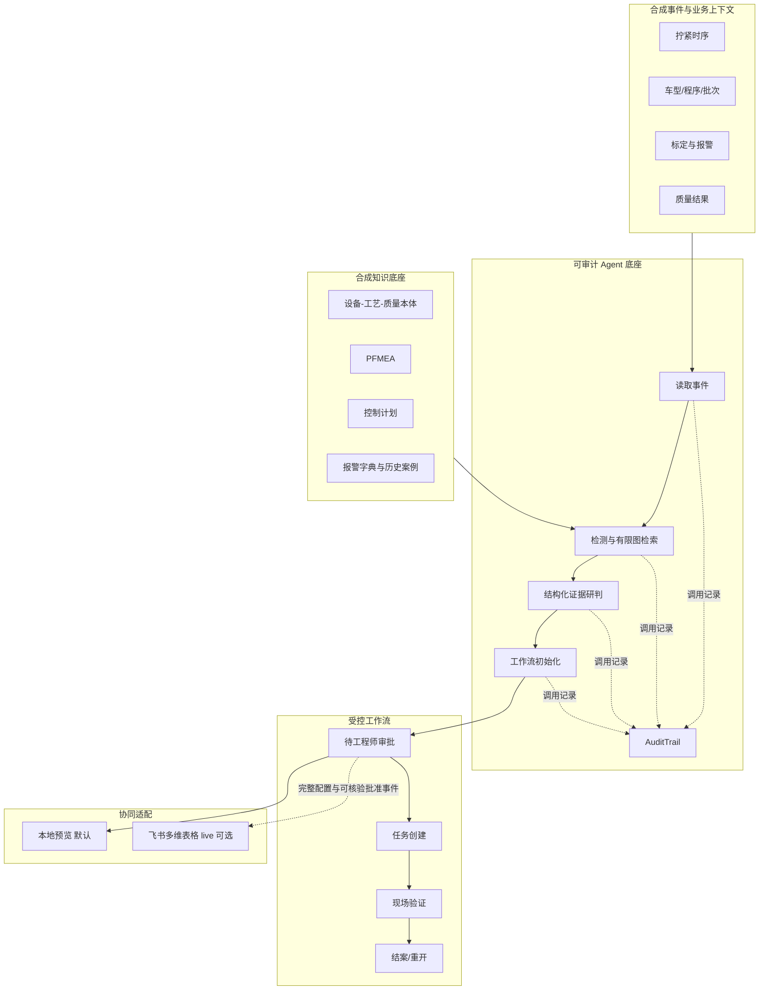

# 架构说明

## 业务与能力边界

第一阶段分析一个模拟总装拧紧工位 `ST-FAS-07`、一个工具 `TOOL-TG-07` 和五个紧固点，P03 是端到端主演示对象。所有事件、设备、工艺、质量和案例均为比赛合成内容，不对应赛力斯真实资产。

系统不接管 PLC，不修改设备参数，也不替工程师确认根因或作出停线、隔离、放行决定。当前仓库能够证明离线分析、证据约束、真实工具边界审计、工作流状态校验以及飞书 live 客户端的代码行为；不能证明实时产线接入、真实外部模型/Aily 调用、授权飞书租户闭环或企业收益。

## 运行组件



图中实线表示仓库内可执行的数据/状态关系，虚线表示审计或需要额外授权的集成关系。公开演示只运行本地预览，没有进入右下角真实飞书租户路径。

## 数据层

[`tightening_events_demo.csv`](../data/tightening_events_demo.csv) 保存设备量测和生产上下文。基线按车型、程序号、紧固点和工具分层；当前合成数据只有一个车型和程序。真实试点还必须处理换型、维修后重建、传感器缺失、时间同步、单位和数据权限。

主演示序列包含 820 条记录；另有脚本生成正常、规格内漂移、传感器零漂和重复报警共 120 个独立合成案例。两套数据都只验证代码行为，不能外推到真实工厂。

## 检测层

[`RiskAnalyzer`](../src/torque_guard/risk.py) 同时使用过程和设备信号：

- SPC 规则识别中心偏移、单向趋势和同侧连续点；
- 角度离散、重试、电流、节拍、标定和报警作为设备侧证据；
- 规格限用于产品判定，但不会替代过程稳定性判断；
- 动态风险指数只用于排序，不改写正式 PFMEA 的 S/O/D 或 RPN。

阈值针对合成场景，真实设备必须重新校准。

## 知识层

本体的最小实体包括设备、工位、程序、紧固点、质量特性、失效模式、原因、验证动作和责任角色。[`KnowledgeBase`](../src/torque_guard/knowledge.py) 从当前对象出发取回有限关系子图、PFMEA、控制计划、报警字典和历史案例。

当前能力是确定性的 **Graph Retrieval**，没有向量召回、语义切片、重排或真实生成模型调用，因此不表述为已经完成完整 Graph RAG。外部模型若在企业环境接入，也只能在取回证据范围内组织待验证假设。

## Agent 与研判层

[`DigitalEmployee`](../src/torque_guard/agent.py) 执行四个真实调用边界：

1. 读取并解析事件；
2. 调用风险分析器完成检测、知识检索和初始风险卡；
3. 调用结构化研判器，强制结论与候选原因引用 `evidence_id`；
4. 初始化受控工作流，进入待工程师审批状态。

[`AuditTrail`](../src/torque_guard/workflow.py) 在调用边界记录序号、调用 ID、开始/结束时间、耗时、输入/输出摘要、成功/失败和错误类型。这些记录在运行时真实产生，不是固定的五行展示文字；但当前只是风险卡内的 JSON 记录，并非企业级防篡改审计平台。

风险卡带有 `schema_version=1.0`；其 `analysis_provenance` 同时保存人工维护的 `risk_policy_version`、规范化知识语义的 SHA-256、规范化实际分析窗口的 SHA-256、卡片身份 SHA-256 及样本/可用性信息。策略规则变更必须同步递增 `risk_policy_version`，知识或输入语义变化则由各自 SHA-256 反映。版本与指纹用于复现和比对，不等同于数字签名，也不能替代企业审计系统。

[`reasoning.py`](../src/torque_guard/reasoning.py) 默认使用确定性研判器。证据不足时拒绝形成候选归因；可选外部模型接口要求配置、API Key 和注入式客户端，且输出必须通过证据引用、Schema 和安全断言校验。缺少条件或外部输出不安全时回退到确定性研判。本项目公开演示没有发生真实 LLM 调用。

受控 Prompt 与结构化合同见 [`system_prompt.txt`](../src/torque_guard/prompts/system_prompt.txt) 和 [`reasoning_output.schema.json`](../src/torque_guard/prompts/reasoning_output.schema.json)。

## 工作流层

[`RiskCaseWorkflow`](../src/torque_guard/workflow.py) 实现以下本地状态：

```text
monitoring_only（稳定窗口，无归因、任务或审批动作）

awaiting_engineer_review
  ├─ approve → approved → create_tasks → tasks_created
  │               → start_verification → verification_in_progress
  │               → pass_verification → verified → close → closed
  │               → fail_verification → tasks_created
  └─ reject → rejected → resubmit → awaiting_engineer_review

closed → reopen → awaiting_engineer_review
```

状态机要求具名操作者；审批、拒绝、结案等关键动作要求说明；创建任务要求任务 ID；验证通过要求现场证据 ID。非法越级会被拒绝。

默认 preview CLI 会把状态快照写入风险卡：稳定窗口进入无动作的 `monitoring_only`，只有触发归因的异常窗口进入 `awaiting_engineer_review`。显式 live CLI 会先记录具名批准，再调用飞书客户端，只有风险表与任务表调用均成功后才进入 `tasks_created`。若任务写入失败，本地状态停在 `approved`，不会宣称任务已创建。上述状态事件仍只保存在本地风险卡，公开演示没有真实工程师执行、企业持久化、结案或案例回写。

## 协同层

[`feishu.py`](../src/torque_guard/integrations/feishu.py) 提供两种模式：

- **preview（默认）：**构造风险/任务字段并写本地 JSON，不读取凭证、不发送网络请求；
- **live（显式）：**配置完整、风险卡校验通过，且强类型批准凭证与风险卡工作流中的真实具名批准事件逐字段一致后，才获取租户 Token，并向指定风险表和任务表批量创建记录；本地联调副本默认隔离到受忽略的 `.local/live/`。

live 请求结构由假传输自动化测试覆盖，但没有在授权企业租户联调。当前没有真实 Aily 应用、飞书审批接入、人员目录校验、跨表事务、幂等保证、结案或案例表写回。详细边界见 [`feishu-integration.md`](feishu-integration.md)。

## 关键数据契约

风险卡包含：对象、窗口、动态风险指数、已观测事实、推断、不确定性、影响范围、证据、候选原因、验证动作、结构化研判来源、真实工具调用轨迹和工作流快照。

每条支持性推断和候选原因必须引用风险卡中存在的 `evidence_id`。外部模型来源、模型名、回退原因、Prompt 与 Schema 版本需要保留；默认产物的 `reasoner_mode` 为 `deterministic`。

任务记录至少包含：风险卡编号、任务编号、责任角色、时限、审批要求、验收依据和状态。正式结案还需持久化实际原因、措施、验证样本、批准人和版本信息；当前公开产物没有真实结案事实。

## 扩展方式

扩展到其他工序时，优先复用证据、审计、审批和状态合同，再增加设备特有信号与控制计划。例如涂胶需要胶宽、胶高、压力、温度和轨迹；焊接需要电流、电压、压力和焊点质量。不能直接复制拧紧阈值，也不能用合成案例成绩替代新工序的静默与对照验证。
