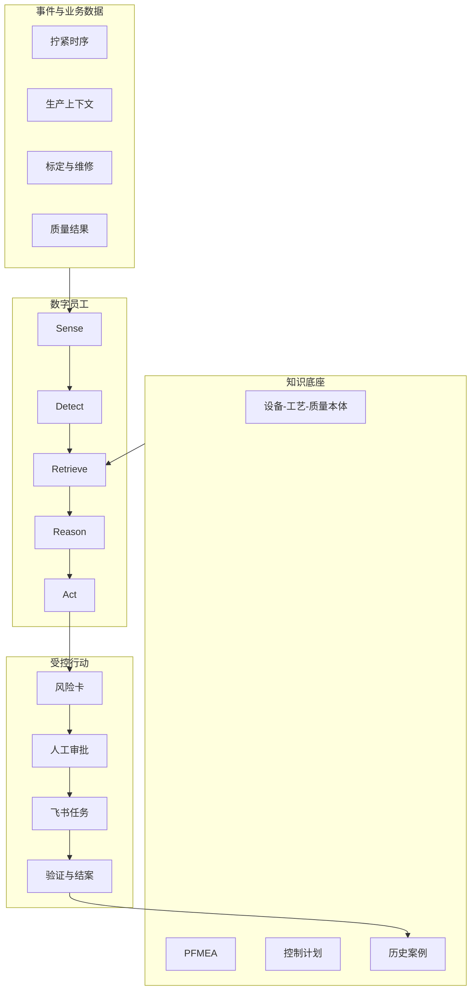

# 架构说明

## 业务边界

第一阶段只分析一个模拟总装拧紧工位 ST-FAS-07、一个工具 TOOL-TG-07 和五个紧固点。P03 是主验证对象。系统不接管 PLC，也不修改设备参数。

这个范围便于核对设备参数与产品质量的关系，也能把时序数据、PFMEA、控制计划和工单放在同一条失效链中。对本科生团队来说，一个工位足以验证从输入到结案的关键环节。

## 运行组件

### 数据层

`tightening_events_demo.csv` 保存设备量测和生产上下文。基线必须按车型、程序号、紧固点和工具分层；当前合成数据只使用一个车型和程序，避免把不同分布混在一起。

### 检测层

检测层同时看过程和设备：

- SPC 规则识别中心偏移、单向趋势和同侧连续点；
- 角度离散、重试、电流和节拍作为设备侧信号；
- 规格限用于判断产品判定，但不会替代过程稳定性判断。

### 知识层

本体的最小实体包括设备、工位、紧固点、质量特性、失效模式、原因、验证动作和责任角色。Graph Retrieval 从当前对象出发取回有限子图，避免把整份知识库塞进一次推理。

### Agent 层

`DigitalEmployee` 是一个可审计的工具编排器：读取事件、运行规则、检索知识、形成风险卡、生成任务字段。当前版本不用外部大模型，便于评委复现每个结果。后续接入 Graph RAG 时，生成模型只负责在已取回证据内组织候选原因与处置草案，不能绕过来源和审批。

### 协同层

飞书适配器输出风险主记录与任务记录。正式接入需要企业提供应用权限、字段 ID、责任人目录和审批规则。仓库不保存凭证，也不调用网络接口。

## 关键数据契约

风险卡至少包含：对象、窗口、动态风险指数、已观测事实、推断、不确定性、影响范围、证据、候选原因、验证动作和 Agent 轨迹。

任务记录至少包含：风险卡编号、任务编号、责任角色、时限、审批要求、验收依据和状态。结案时还需记录实际原因、措施、验证样本和批准人。

## 扩展方式

扩展到其他工序时，优先复用通用实体和工作流，再增加设备特有的信号与控制计划。例如涂胶需要胶宽、胶高、压力、温度和轨迹；焊接需要电流、电压、压力和焊点质量。不能把一套拧紧阈值直接复制过去。
