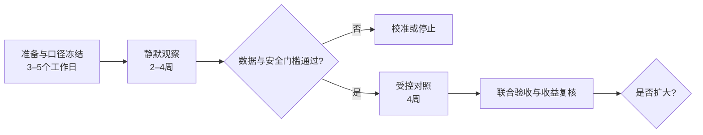

# 企业试点与对照验证计划

## 1. 试点目标

试点不是把比赛原型直接接管产线，而是在不改变现有质量控制责任的前提下，回答四个问题：

1. 真实设备与生产上下文能否稳定映射到分层基线；
2. 规格内漂移等早期信号能否被可靠识别，且误报可接受；
3. 带证据的风险卡能否缩短工程师定位和派单时间；
4. 处置结果能否形成可审计、可复用的知识案例。

建议从一个工厂、一个总装拧紧工位、一类关键连接和有限车型/程序组合开始。当前仓库里的 `ST-FAS-07`、`TOOL-TG-07`、`P03` 都是模拟编号，不能直接映射为企业资产。

## 2. 不变的安全边界

- 原系统、现有报警和质量控制流程在整个试点期间继续运行；系统不得屏蔽现有信号。
- 首期只读接入设备与质量数据，不向 PLC、控制器或工具写入参数。
- 风险卡是待复核的建议，不是产品合格判定，也不替代 PFMEA、控制计划或人员职责。
- 停线、隔离、返工、参数修改、根因确认和结案均由授权人员决定。
- 无足够证据、数据质量异常或对象映射不确定时，系统应降级为“需人工复核”，而不是强行给出结论。
- 飞书写入仅在企业应用授权、字段映射和审批门禁通过后启用；所有写入保留操作者、时间、请求摘要和结果。

详细权限约束见 [`docs/safety-boundaries.md`](safety-boundaries.md)。

## 3. 总周期



静默观察至少 2 周；如果没有覆盖约定的班次、车型/程序或足够独立事件，则延长至 4 周。受控对照固定 4 周，不用增加窗口数量替代观察时长。

## 4. 阶段 0：准备与口径冻结（3–5 个工作日）

### 输入核对

| 工作项 | 输出 | 通过条件 |
|---|---|---|
| 对象映射 | 工厂—车间—工位—工具—程序—紧固点映射表 | 随机抽查记录可回到正确对象 |
| 字段字典 | 单位、时区、缺失值、状态码、维修/标定、质量结果定义 | 业务与 IT 共同签字确认 |
| 基线分层 | 车型、程序号、紧固点、工具及必要的班次/物料层级 | 不把明显不同分布混入同一基线 |
| 事件定义 | 独立风险事件、冷却期、开始/结束时间和严重度 | 在看结果前冻结 |
| 标签规则 | 真风险、正常、无法判断的工程师标注规范 | 至少双人复核争议样本 |
| 权限矩阵 | 读、写、审批、结案和审计权限 | 无 PLC 写权限；最小权限原则通过 |
| 指标字典 | 召回、误报、提前量、定位时长、完整率和收益公式 | 分母、排除项和数据源明确 |

### 准入条件

- 连续数据可用率、时间戳一致性和对象映射准确率达到企业预先约定的门槛；
- 原有质量处置流程、升级联系人和紧急回退方式已经确认；
- 合成数据中的阈值未被直接当作生产阈值；
- 真实数据经脱敏、授权并限定在试点范围内；
- 关键角色完成一次桌面演练。

任一安全或权限条件未通过，只能继续离线校准，不能进入写入或派单阶段。

## 5. 阶段 1：静默观察（2–4 周）

### 运行方式

- 系统读取事件、运行检测和知识检索、生成风险草案，但不向现场人员主动派单。
- 每条草案记录输入摘要、规则命中、证据 ID、推理器类型、工具调用轨迹、耗时和错误。
- 工程师按冻结规则独立标注事件；评估人员在约定周期后揭盲比对，避免提示影响真值判断。
- 相邻窗口按冷却期合并为独立事件；窗口级指标仅用于调参，不作为最终业务成绩。
- 阈值调整必须版本化。用于调参的数据不得同时作为最终验收集，必要时按时间切分校准期与验证期。

### 每周输出

| 输出 | 内容 |
|---|---|
| 数据质量周报 | 缺失、延迟、重复、单位异常、对象映射失败和换型分布 |
| 风险回放包 | 独立事件、风险卡、证据链、工程师盲标和分歧原因 |
| 误报/FN 复盘 | 错误类型、可否通过数据或规则修正、是否存在安全风险 |
| 版本记录 | 规则、知识、Prompt/Schema、代码与阈值版本 |
| 权限与审计报告 | 数据访问、失败请求、人工审批和异常行为 |

### 进入受控对照的门槛

门槛数值由企业在阶段 0 冻结；至少满足：

- 没有未经授权的写操作或高风险安全事件；
- 数据质量足以支持已选分层，不存在持续性时间错位；
- 风险卡能够回到原始信号和受控文档；
- 工程师能够理解候选原因和验证动作，且系统会表达不确定性；
- 误报量不至于造成不可接受的告警负担；
- 已形成可执行的回退和故障处理流程。

## 6. 阶段 2：受控对照（4 周）

### 对照原则

所有对象都继续执行现有质量流程，不设置“降低安全标准”的对照组。试验比较的是是否向工程师额外展示“质控前哨”风险卡和受控任务，而不是比较有没有基础质量保障。

优先采用以下一种设计，并在开始前固定：

1. **匹配对象对照：**选择历史事件量、车型/程序和节拍相近的紧固点，一组使用辅助风险卡，一组只执行现有流程；
2. **阶梯式切换：**不同对象按预先排定的周次逐步启用辅助能力，尚未启用的对象作为同期对照；
3. **时间块交叉：**同一对象按完整班次或完整周交替启用，避免同一事件跨组污染。

如果只有一个对象且独立事件太少，应把结论限定为流程可行性，不强行报告统计显著性或财务收益。

### 辅助组工作流

```text
早期信号 → 风险草案 → 工程师确认 → 经授权写入风险主表
        → 审批通过 → 任务派发 → 现场验证 → 结案 → 案例回写
```

审批拒绝、证据不足、任务超时、接口失败和重复事件都必须作为明确状态记录，不得只保留成功路径。

### 主要指标

| 类别 | 指标 | 目标/口径 |
|---|---|---|
| 检测 | 高风险召回率 | 试点目标 ≥85%；以去重独立事件和工程师真值为单位 |
| 检测 | 误报率 | 试点目标 ≤15%；同时报告每百设备小时提示数 |
| 时效 | 提前介入时间 | 试点目标相对现状平均提前 ≥2 小时；报告中位数和分布 |
| 效率 | 定位时间 | 试点目标相对现状中位数缩短 ≥30% |
| 可信 | 证据完整率 | 来源、定位、时间/版本字段齐全的风险卡占比 |
| 协同 | 任务与结案完整率 | 责任人、时限、验收依据、审批、结论和附件齐全的占比 |
| 体验 | 工程师采纳/驳回及原因 | 不把采纳率单独当正确率；分析拒绝原因 |
| 价值 | 可归因净收益 | 只使用联合复核通过的事件，按 [`docs/business-value.md`](business-value.md) 公式计算 |

除总体结果外，必须按车型/程序、紧固点、工具、班次和风险类型报告分层结果；样本不足的分层只报告原始计数，不报告稳定比例。

## 7. 飞书与 AI 能力验收

### 当前仓库能够证明

- 能从数据、规则、知识关系生成带证据 ID 的风险卡；
- 能生成包含责任角色、时限、验收依据和审批要求的飞书字段；
- 代码支持无凭证预览；live 方法要求风险卡处于已批准状态，并核对强类型工作流批准凭证、批准人和依据，本地状态机也会拦截审批前建任务；
- 默认采用确定性推理，便于复现，不能据此声称已经调用外部大模型。

CLI 已按顺序协调本地状态机与飞书 live 客户端，并覆盖“任务表失败时不进入任务已创建”的测试；状态事件仍未持久化到飞书，测试也使用假传输而非授权租户。上述门禁是可核验代码合同，不是已经完成的飞书审批或企业身份认证。

### 企业环境需要验证

- Aily/受控 Agent 的应用身份、知识权限和工具白名单；
- 多维表格真实应用凭证、表格字段 ID、人员目录和最小写权限；
- 真实创建、审批拒绝、重试、幂等、超时、撤销和结案全链路；
- Prompt 与结构化输出 Schema 的版本记录、引用约束和无证据拒答；
- 截图或审计日志能证明调用发生在授权测试租户，而不是本地预览。

在上述验证完成前，对外统一表述为：**代码具备经授权写入与外部模型接入能力；公开环境默认使用预览和确定性推理，尚未形成真实企业租户调用证据。**

## 8. 停止、降级与回退条件

出现以下任一情况，立即关闭主动派单并退回静默模式：

- 未授权的数据访问或写入；
- 对象映射错误导致风险卡关联到错误工位、工具或批次；
- 重复任务、接口重试或幂等失败造成协同干扰；
- 提示量超过企业冻结的告警负担上限；
- 模型输出缺少证据引用、越权给出停线/改参数指令或泄露敏感信息；
- 现有质量流程受到阻塞；
- 重大现场变更使基线失效，但系统没有正确降级。

回退不删除审计记录。恢复前必须完成原因分析、修复验证和负责人批准。

## 9. 角色与交付物

| 企业角色 | 主要责任 | 阶段交付物 |
|---|---|---|
| 质量负责人 | 冻结事件真值、验收口径和安全决策 | 标签规范、事件复核、验收签字 |
| 设备工程师 | 核验工具、标定、维修和设备信号 | 点检结果、维修记录、候选原因验证 |
| 工艺工程师 | 核对程序、紧固点、物料与控制计划 | 分层规则、控制要求、变更记录 |
| 生产负责人 | 保障现场节拍与现有流程 | 运行窗口、升级和回退批准 |
| IT/飞书管理员 | 数据、应用、权限、日志与密钥 | 接口映射、权限清单、审计与故障演练 |
| 项目团队 | 实现、监控、复盘和版本管理 | 周报、风险回放包、最终评估报告 |

实际姓名、审批人和替补联系人由企业启动会填写，不在公开仓库中虚构。

## 10. 推广路线

推广采用“先同类复制，再跨工序抽象”的顺序：

1. **同工具/同程序：**在验证过的分层内增加紧固点，复用信号和工作流；
2. **同工艺跨工具：**重新校准基线和设备健康特征，不直接复制阈值；
3. **同工厂跨车型：**增加车型、程序和物料上下文，验证知识权限和事件量；
4. **跨工厂：**部署独立数据与权限边界，只共享经过批准的模式与模板；
5. **跨工序：**涂胶、焊接等只复用“感知—证据—审批—闭环”骨架，重新定义信号、失效链和验收标准。

每一级都必须重新经过静默观察和安全门槛；上一级成功不自动证明下一级有效。

## 11. 最终评审包

- 冻结后的指标、事件和排除规则；
- 数据质量与对象映射报告；
- 去重后的独立事件清单和工程师盲标；
- Before/After 原始计数、分层结果与误差说明；
- 误报、漏报、拒绝和异常接口案例；
- 风险卡、审批、任务、验证、结案和案例回写审计链；
- 可归因收益计算表及企业确认的数据来源；
- 安全事件、回退记录和后续扩大/校准/停止建议。

只有这份评审包完成联合签字后，试点目标才能转述为真实业务成果。
