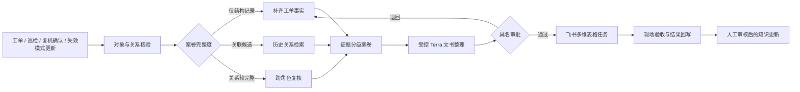

# 【40强赛】赛力斯集团🤝智造哨兵｜质控前哨 V2：设备质量风险关系证据闭环数字员工

## 项目信息卡

| 项目 | 内容 |
| --- | --- |
| 队伍 | 智造哨兵 |
| 企业命题 | 如果你加入赛力斯超级工厂团队，你如何打造一名会主动管控设备质量风险的 AI 数字员工？ |
| 一句话方案 | 面向工单、设备对象与失效模式关系不完整的真实情况，先完成证据分级与补证协同，再进入可复核的风险处置闭环。 |
| 团队分工 | 智能车辆工程：场景建模、质量链路与答辩；软件实现：关系核验、规则与前端；产品与协同：飞书字段、材料和演示。成员姓名以报名页登记信息为准。 |
| 飞书能力 | 以多维表格承接“案卷—任务—验收—回写”字段；公开演示只生成预览，正式写入保留具名审批与授权门禁。 |

> 数据声明：赛题提供的脱敏材料仅用于理解对象、字段及关联关系。项目没有抽取原始文本、没有进行时序预测，也不把静态快照写成真实设备状态或企业收益。

## 一、场景与痛点

设备质量管理的难点并不总是“没有数据”。设备台账、故障工单、失效模式和功能关系往往已经存在，但不同记录的完整度不一致：有的工单可以关联到设备对象，有的只保留了结构字段；部分失效模式只是历史关联，不能直接当作本次故障结论。若把这些关系直接交给通用模型，很容易出现两类问题：一是把历史关联说成现场根因；二是记录缺项时仍给出貌似完整的处置建议。

作为智能车辆工程专业学生，我们把设备风险放在“设备对象—功能—失效模式—质量复核”的业务链里理解。项目不替代设备、质量或工艺工程师，而是先把每个事件整理为可核验案卷：哪些关系是直接事实，哪些只可作为检索候选，哪些字段必须补齐。这样，风险处置从一开始就能回到设备对象、工单依据和现场验收条件。

## 二、方案创新点

### 1. 关系证据分级，而不是把知识图谱当作结论引擎

对每个事件，系统按“直接事实、历史候选、信息缺口”三类输出。设备实例与类别、工单状态等结构事实可以直接使用；工单与失效模式的历史关联只能作为待核验候选；现象、检查结果、复机依据缺失时，系统先生成补证任务。关系链的存在不等于根因已经成立。

### 2. 面向工单完整度的主动策略

系统不是收到事件后统一生成分析结论，而是先判断案卷可进入哪一步。仅有工单结构记录时，数字员工停止原因推断，要求补齐现场事实；具备设备—失效模式候选关联时，才允许检索相关历史记录，并明确标注“待核验”；关系较完整时，由设备、质量、工艺按职责共同复核。这种分流更接近制造现场的责任边界。

### 3. 模型输出受证据与权限双重约束

Terra 只接收最小化的结构案卷，用于整理复核说明、补证问题和任务备注。调用设置为单次、低随机性、600 token 上限和 12 秒超时；输出必须通过 JSON 字段与安全标志校验。模型不得确认根因、判断质量放行、建议停线或写入外部系统。无模型凭证或输出不合格时，系统退回确定性案卷。

### 4. 从“提示”到可追溯任务

每项任务带有责任角色、建议时点、验收依据、证据编号和审批要求。审批前只形成飞书多维表格预览；现场核验后，结论作为候选知识更新，仍需人工审核。系统保留“无法判断”和“待补证”状态，避免闭环表面完成、事实没有补齐。

## 三、具体方案

原型以三类自建合成案卷演示不同分流：安全防护对象的跨角色复核、控制与电气报警的工单补证、机器人对象的历史关联差异核验。公开页面展示每个案例的关系路径、证据分级、任务草案与模型边界。源数据不进入公开仓库；公开案例均以 `CASE-DEMO-*` 标识，并在构建与测试中校验。

## 四、预期业务价值与验证方式

第一阶段的价值是减少“错误地把关联当结论”的风险，并让不同角色面对同一份有依据的任务草案。系统可减少人工在台账、工单和历史记录之间反复确认对象关系的时间，但不会虚构节省金额或准确率。

进入企业试点后，建议选择一个设备类别和有限范围的事件类型，先静默运行，统计：工单事实补齐率、关联核验完成率、任务字段完整率、审批退回原因和结案记录完整率。只有在对象映射、权限、人工验收和数据质量均通过后，才评估风险发现时效、工程师处理时长及可归因业务收益。停线、参数调整、质量放行、根因确认始终由授权工程师决定。

## 五、体验入口与视频

- 在线演示：`https://gikemj.github.io/tightening-quality-guardian/round2.html`
- 源码与复现：`https://github.com/Gikemj/tightening-quality-guardian`
- 演示视频：`https://gikemj.github.io/tightening-quality-guardian/video/quality-guardian-v2.mp4`（约 4 分 25 秒，已内嵌中文字幕；按“数据边界—三类案卷—任务门禁—试点路径”讲解，不展示原始脱敏数据）。

## 附：原型可核验范围

| 能力 | 当前状态 | 不作的声明 |
| --- | --- | --- |
| 关系案卷 | 已实现，三类公开合成案例可切换 | 不代表真实设备或工单 |
| 分流与任务 | 已实现，任务有证据、验收和人工审批字段 | 不代表真实任务已创建 |
| Terra 接入 | 已实现可选服务端受控客户端与安全校验 | 不代表生产环境已调用或接管处置 |
| 飞书协同 | 已实现多维表格字段映射和预览 | 不代表企业租户已联调 |
| 试点评估 | 已给出口径和门禁 | 不报告真实准确率、提前量或 ROI |

项目代码对公开案例、任务证据、密钥扫描及页面资源均设置了自动校验。复现命令见仓库 README；安全边界和数据说明见在线演示页。
